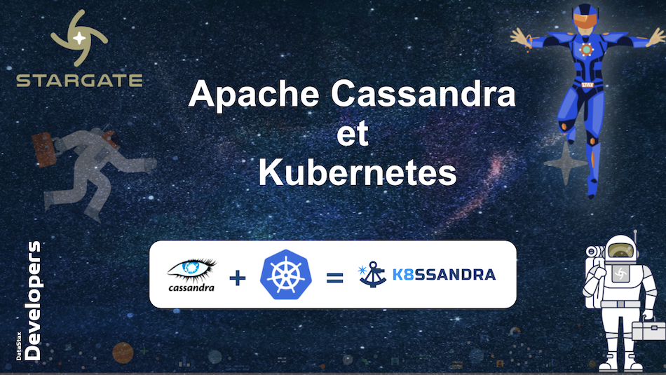

# Training Apache Cassandra and Kubernetes

This resources should be used alongside the slides in the current repo for a 6h training on how to run Cassandra in Kubernetes. For any question please ping [cedrick.lunven@datastax.com](mailto:cedrick.lunven@datastax.com)

## Table of Content

1. [Apache Cassandra™ Fundamentals](cassandra-kubernetes#1-apache-cassandra-fundamentals)
2. [Data Modelling](https://github.com/DataStax-Academy/training-cassandra-kubernetes#2-data-modelling)

## 1. Apache Cassandra™ Fundamentals

### Resources

-  Presentations by Netflix : [Cassandra Scales linearly](netflixtechblog.com/benchmarking-cassandra-scalability-on-aws-over-a-million-writes-per-second-39f45f066c9e
)

- Presentations by Netflix : [Cassandra Use Cases a netflix](https://www.youtube.com/watch?v=BODvXsQYyaY)

*Need to sign (free Account)*
- [DataStax Academy course 101](https://academy.datastax.com/#/online-courses/0da20519-364d-47a9-9916-b59c02175393)

*Need to sign (free Account)*
- [DataStax Academy course 201](https://academy.datastax.com/#/online-courses/6167eee3-0575-4d88-9f80-f2270587ce23)

- [Workshop Introduction to NoSQL](https://github.com/datastaxdevs/workshop-introduction-to-nosql)

- [Workshop Introduction to Cassandra](https://github.com/datastaxdevs/workshop-intro-to-cassandra)

### Hands-on

1. [Introduction to Apache Cassandra™](https://www.datastax.com/learn/cassandra-fundamentals/cassandra)

2. [Cassandra Query Language](https://www.datastax.com/learn/cassandra-fundamentals/cql)

3. [Apache Cassandra™ Keyspaces and Data Replication Strategies](https://www.datastax.com/learn/cassandra-fundamentals/keyspaces)

4. [Inserts, Updates, Deletes and Upserts in Apache Cassandra™](https://www.datastax.com/learn/cassandra-fundamentals/inserts-updates-deletes)

5. [Queries in Apache Cassandra™](https://www.datastax.com/learn/cassandra-fundamentals/queries)

6. [Using Advanced Data Types in Apache Cassandra™](https://www.datastax.com/learn/cassandra-fundamentals/advanced-data-types)

## 2. Data Modelling

### Resources

### Hands-on

